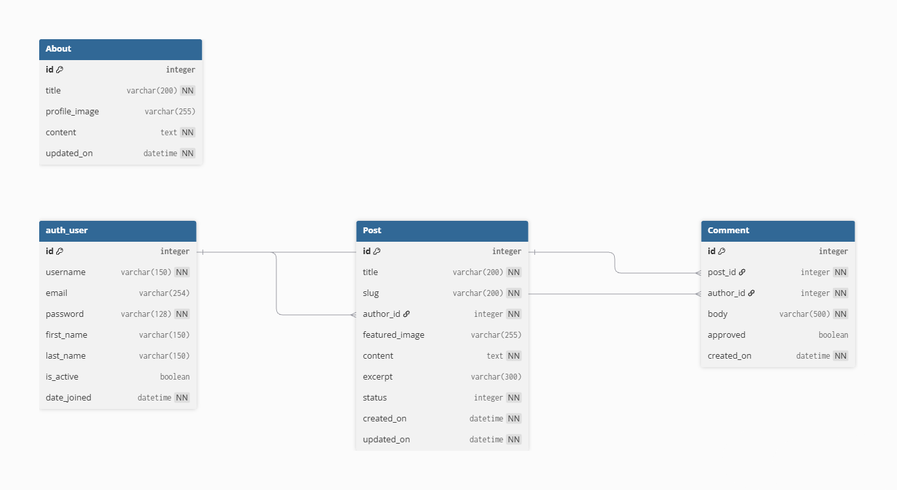
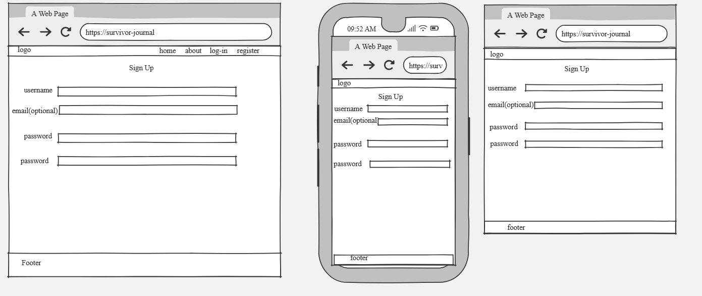
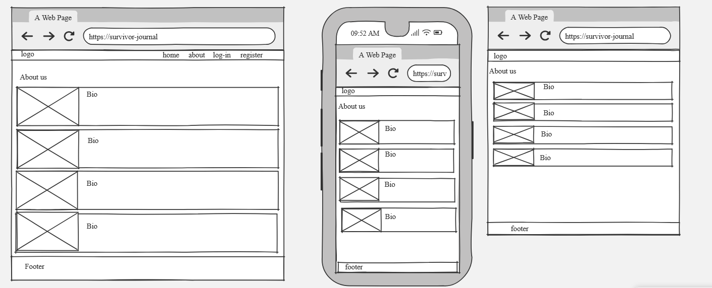

# Survivor Journal

## Overview
The Bootcamp Survivor Journal is a Django based project designed to give students of the 16 week Code Institute Bootcamp a place to document their personal experiences of undertaking and completing the 16 week Full Stack Development course.
This is not just a log of tasks, it is a place for students to record their transformation and resilience throughout the course. A place for them to voice their trials and tribulations.

## Table of Contents

## UX Design

## Project Planning
MOSCOW Prioritisation

ERD Diagram

Wireframes

Home Page

Sign up Page

About us Page

## Key Features

## Developer Notes

## Deployment

Heroku deploy notes:

- Ensure Debug=False and Whitenoise is enabled
- Push code and build:
	- git add . git commit -m "" git push, pushing all the data to github for deployment to Heroku
- When the code is pushed to GitHub, go to Heroku, go to the deploy tab in heroku, scroll down and click 'Deploy Branch' 
- When Heroku finishes the build, the logs can be viewed in case of any errors
- After ensuring there are no errors, click 'Open App' or 'View' to open the deployed app

## AI Implementation

## Credits